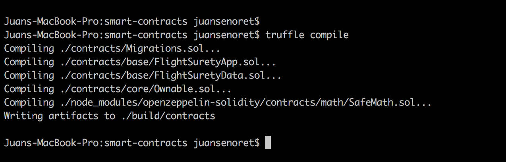

# FlightSurety Dapp

FlightSurety is a sample application project to demonstrate how oracles work providing external information to a smart contract in Ethereum network. Additionally I wanted to show how Web3 can be injected to an Angular client project and start to interact with an ethereum smart contract. Finally I built a server based in hapi framework to show how from the client side we can build REST APIs to interact as well with the an ethereum smart contract.

## Project description

- Smart contract:
You will find the smart contract under "smart-contracts" folder. In this folder you will find a standard smart contracts development architecture based on Truffle.

- Server:
Under "server" folder you will find the server implementation based on "hapi" framework.

-Client:
In the folder "client" you will find a client implentation built using Angular 7


## Getting Started

These instructions will get you a copy of the project up and running on your local machine for development and testing purposes.

### Prerequisites

Please make sure you've already installed ganache-cli, Truffle and enabled MetaMask extension in your browser.

- Install ganache (graphical interface) and ganache-cli in your local environment
Donwload the installer from [https://truffleframework.com/ganache]

```
npm install -g ganache-cli
```

###  Libraries used
In each subfolder you will find the package.json to build each part. Here a summary of the most important packages used during the implementation.

- node.js (Version 10.15.1): As an asynchronous event driven JavaScript runtime, Node is designed to build scalable network applications.

- hapi (Version ^18.1.0): Node.js package to build REST APIs or web services

- web3 (Version 1.0.0-beta.46 and Version 1.0.0-beta.37 for the client): This is the Ethereum JavaScript API which connects to the Generic JSON RPC spec to connect to the ethereum node an interact with the smart contract.

- truffle-hdwallet-provider (Version 1.0.5): HD Wallet-enabled Web3 provider. Use it to sign transactions for addresses derived from a 12-word mnemonic. Package to access to a provider in case you want to deploy the smaret contract in a public network like Rinkeby, Ropsten, etc.

- Truffle (Version 5.0.7): Truffle is a development environment, testing framework and asset pipeline for Ethereum, aiming to make life as an Ethereum developer easier.


### Installing and user guide to use the client app

A step by step series of examples that tell you have to get a development env running

- Clone this repository:

```
git clone https://github.com/JuanSenoret/flight-surety-angular-hapi.git
```

- Change directory to ```smart-contracts``` folder and install all requisite npm packages (as listed in ```package.json```):

```
cd smart-contracts
npm install
```

- Launch Ganache: I prefer to use the Ganache GUI instead of ganache-cli but only take in consideration to use the port 7545. Otherweise you have to update several configuration files in which this port is hard coded. Other consideration is to configure your ganache to use at least 40 accounts. When you want to test the oracle part it will be necessary to have this amount of accounts

- Copy the truffle-example.js and create a new file truffle.js.

**(Optional if you want to deploy the contract in apublic network like Rinkeby!)** Change the constant MNEMONIC with your account menomic and change API_KEY with your infura API Key

- Compile smart contracts:

```
truffle compile
```

Your terminal should look something like this:


This will create the smart contract artifacts in folder ```smart-contracts\build\contracts```.

- Migrate smart contracts to the locally running blockchain, ganache GUI or ganache-cli:

```
truffle migrate --network development
```

Your terminal should look something like this:


In ```smart-contracts\migrations\2_deploy_contracts.js``` file you can see that I have implemented a feature to copy the contracts ABI and addresses to the corresponding folders in client and server parts. In that case you don´t have to copy manualy the ABI and addresses each time that you migrate a new smart contract to your local ganache network.

- Test smart contracts:

To test the oracle part I have created a separate test file. YOu will find under ```smart-contracts\test\oracles.js```. To execute it please call it using the following npm script

```
npm run test-oracles
```

Your terminal should look something like this:


To execute the full test package call the following npm script (it will take several seconds)

```
npm run test-dapp
```

Your terminal should look something like this:


All 38 tests shall pass.

- In a separate terminal window, launch the Server: Change directory to ```server``` folder and install all requisite npm packages (as listed in ```package.json```):

```
cd server
npm install
```

- Start the server: be sure that ganache is running and you have already migrate the smart contracts

```
npm run start
```

Your terminal should look something like this:


During server start I have added a initialization module in order to set-up the smart cotracts and be able to start to interact with them. Below you can check which action are performed during the initialization:
1) Authorize App contract address to call data contract
2) Register Lufthansa airline and submit fund (assumption: min fund 1 Ether instead of 10 Ether)
3) Register KLM airline and submit fund
4) Register two flights for each airline (assumption: as flight code I have used the IATA code which is a code to identified flights depending of the rout and the departure time)
5) Register oracles

- In a separate terminal window, launch the Client: Change directory to ```client``` folder and install all requisite npm packages (as listed in ```package.json```):

```
cd client
npm install
```

- Configure Metamask to connect to your local ganache network ```http://127.0.0.1:7545``` where the contract has been deployed:


- Import at least one account from your ganache network to Metamask (it will be your account as passenger to interact with the smart contract). You can copy the private key from the ganache GUI


- Start the client app:

```
npm run start
```

Your terminal should look something like this:


After start the local Angular frontend server you can open the app in a browser calling http://localhost:4200


As you can check the client is calling a REST API to the server to retrieve the registere flights details. We can make it from the client side but I wanted to demostrate that it can be done from the server side.

- In the page ```Flights```, try to buy an insurance for a Lufthansa airline flight (assumption only three amounts are valid 0.01 Eth, 0.02 Eth and 0.03 Eth).

Your terminal should look something like this:


Assumption: a passenegr can buy more than one insurances but only one per flight until the flight is finalzed and the smart contract can handel the status of the insurance.

- Go to the page ```My Insurances``` and you can check your insurances details.

Your terminal should look something like this:


As you can see your insurance is in progress because we are wating for the oracle information to process the insurance status. At this moment you can not withdraw the insurance payout and the button for withdraw is disable.

- Go to the page ```Oracle``` and you can trigger the request and response for the oracles. That is the way to simulate the oracle behaviour. Select the flight which you have bought your insurance submit the request/response sending the status value ```Delay due to airline (20)```. That status is the only one that will give us the possibility to get the insurance payout. It takes severl second to process the submit responses (depending of the amount of accounts that you confiured your ganache local network)

Your terminal should look something like this:


- Go again to the page ```My Insurances``` and check again your insuranes status. Now you have to see that the withdraw button for your insurance is enable (if you selected the ```Delay due to airline (20)``` in the Oracle page)

Your terminal should look something like this:


Click on Withdraw button and you will get the payout for this insurance


The status of the insurance has changed to expired because the proces has finished. And of course the Withdraw button is disable. Please check your metamask balance account to see that you have been paid.


## Trouble shooting

Some time when you start and stop the ganache local network Metamask wallet will be unsync with the ganache network and you have to unistall Metamask from wou browser and install again. Normally you will see an error message related to the nonce or something like that:


## Resources

* [How does Ethereum work anyway?](https://medium.com/@preethikasireddy/how-does-ethereum-work-anyway-22d1df506369)
* [BIP39 Mnemonic Generator](https://iancoleman.io/bip39/)
* [Truffle Framework](http://truffleframework.com/)
* [Ganache Local Blockchain](http://truffleframework.com/ganache/)
* [Remix Solidity IDE](https://remix.ethereum.org/)
* [Solidity Language Reference](http://solidity.readthedocs.io/en/v0.4.24/)
* [Ethereum Blockchain Explorer](https://etherscan.io/)
* [Web3Js Reference](https://github.com/ethereum/wiki/wiki/JavaScript-API)